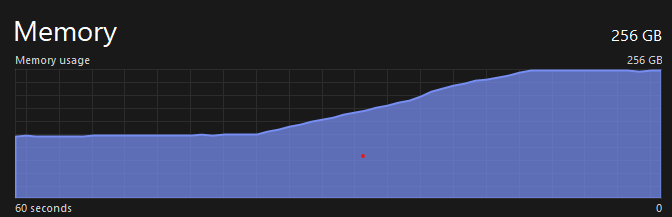

# pickle_injector

### Denial of service

billionLaughs.pt is smaller but utilizes the dupe instruction which is disabled in some pickle parsers. billionLaughsAlt.pkl has to use roughly twice as many bytes, but both are typable on a keyboard and should cause a MemoryError on all reasonable systems.

If you need to make it bigger, add `(` to the beginning, and continue the pattern between `l` at the end before the `.`

### Exploitation
Pickles are broken, if you see one you can easilly plant a backdoor into it using the `inject.py` script.
```bash
python inject.py existingPickle.pt newBackdooredPickle.pt malware.py
```

### Mitigation
If somone wishes to fix the issue, `SecureAlternative.py` shows an example solution for pytorch to save model weights securely.

### Detection
- [Yara Rule created by Medsterr](https://github.com/medsterr/yara/tree/main/python/pickle_injector)

### Related Presentation
- [DEFCON Powerpoint Version](https://coldwaterq.com/presentations/ColdwaterQ%20-%20BACKDOORING%20Pickles%20A%20decade%20only%20made%20things%20worse%20-%20v1.pptx)
- [DEFCON PDF Version](https://coldwaterq.com/presentations/ColdwaterQ%20-%20BACKDOORING%20Pickles%20A%20decade%20only%20made%20things%20worse%20-%20v1.pdf)
- [DEFCON Demo Gif](https://coldwaterq.com/presentations/ColdwaterQ%20-%20BACKDOORING%20Pickles%20A%20decade%20only%20made%20things%20worse%20-%20v1%20-%20demo.gif)
